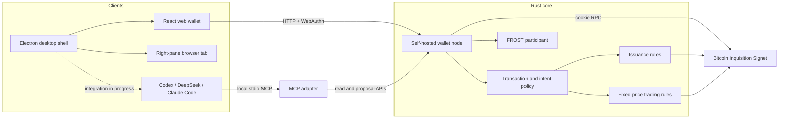

# Catomicals

English | [简体中文](README.zh.md)

Catomicals is a self-hosted covenant wallet and application research stack for Bitcoin Inquisition Signet. It tests whether `OP_CAT` asset issuance, protected trading, Passkey approval, FROST threshold signing, and agent collaboration can form a usable product.

> [!WARNING]
> The current code only permits Signet and has not received an independent security audit. Keys, credentials, and replay-protection state still live in process memory. **Do not use it on mainnet or with assets that have real-world value.**

`catomicals` is an internal engineering name formed from CAT + Atomicals. The name has no protocol meaning. The project does not inherit the Atomicals, CAT Protocol, or CAT20 design, and it has no platform token.

## Why OP_CAT

`OP_CAT` lets Bitcoin Script concatenate byte strings. A Taproot script path can use that capability to reconstruct and verify commitments, messages, and local state. It provides a new verification primitive for:

- script-verified minting gates and state commitments;
- UTXO orders bound to explicit prices and cancellation conditions;
- wallet-verifiable transaction intents, creator fees, and state transitions;
- local financial and digital-item experiments without a general-purpose VM.

The limits matter just as much. The current issuance script cannot inspect transaction outputs, so the item owner, successor state, and fees remain wallet-policy checks. Fixed-price trading relies on the seller's `SIGHASH_DEFAULT` signature and wallet policy to protect exact outputs. The code, tests, and documentation preserve these limits and do not present experimental-network results as Bitcoin mainnet capabilities.

## Current capabilities

| Status | Capability | Details |
| --- | --- | --- |
| Implemented | Inquisition node check | Uses cookie-authenticated RPC to inspect a local Signet node and requires active BIP 347 / `OP_CAT`. |
| Implemented | 2-of-3 FROST demonstration | Runs the Zcash Foundation FROST DKG, aggregates a 64-byte BIP340 signature, and verifies it independently; local development only. |
| Implemented | Self-hosted wallet node | Provides typed HTTP APIs, WebAuthn registration and approval, immutable signing intents, transaction inspection, and one local FROST participant. |
| Implemented | Web wallet | Provides a chat workbench, live node status, transaction inspection, signing intents, Passkey ceremonies, and signing-phase status. Chat can only create proposals. |
| Implemented | Local MCP | Codex, DeepSeek Harness, and other clients can read status, inspect transactions, and create or cancel intents. MCP cannot approve, sign, or broadcast. |
| Implemented | Proof-of-work issuance experiment | The `OP_CAT` script verifies the current state's proof of work and remaining supply. The wallet separately verifies the item output and successor state. |
| Implemented | Protected fixed-price trading experiment | Supports listing, buying, and height-locked cancellation, with checks for seller payment, fixed creator fees, buyer ownership, and network fees. |
| In progress | Electron desktop shell | The source includes an isolated renderer, a real browser tab in the right pane, tool-pane IPC, and local settings storage. Product integration and packaging remain incomplete. |
| In progress | Conversational harness selection | The UI defines Codex, DeepSeek Harness, Claude Code, model, reasoning effort, and working-directory settings. The execution adapter currently returns `not-connected`. |
| In progress | Account entry point | Local Passkeys support wallet registration and transaction authorization. Google, Apple, and email login currently have UI and type definitions only; there is no OAuth, email-verification, or account backend. |
| Planned | Production custody and protocol work | Durable keys, replay protection, remote FROST, backup and recovery, authenticated agent transport, AMM research, and mainnet assessment remain unfinished. |

## Components



Security responsibilities are deliberately separated. Human interfaces and agents may read state, prepare transactions, and create proposals. Only a real Passkey ceremony completed by the wallet node can release a one-time signing authorization. Before producing a share, the FROST participant rechecks the intent, digest, session, participant, expiry, and nonce.

## Quick start

### 1. Prepare the development network

The installer downloads Bitcoin Inquisition `v29.4-inq`, verifies it against the official `SHA256SUMS`, and copies the sample configuration. It does not start the node or synchronize the chain.

```bash
./scripts/install-bitcoin-inquisition.sh
```

Start and synchronize Inquisition Signet with [config/bitcoin-signet.conf](config/bitcoin-signet.conf). RPC listens on `127.0.0.1:38332` by default, and the authentication cookie is stored under `signet/.cookie` in the node data directory.

After the node is synchronized and `OP_CAT` is active, run this command from the repository root:

```bash
cargo run -p catomicals -- node health
```

### 2. Start the wallet node

Rust 1.91 or newer is required.

```bash
cargo run -p catomicals -- wallet serve \
  --addr 127.0.0.1:18787 \
  --rp-id localhost \
  --rp-origin http://localhost:5173 \
  --cors-origin http://localhost:5173
```

The wallet node temporarily runs a local 2-of-3 DKG and retains participant 1 only. Stopping the process loses the current key, Passkeys, intents, chat history, and replay-protection state.

Run the threshold-signature demonstration separately with:

```bash
cargo run -p catomicals -- frost demo
```

### 3. Start the web wallet

Node.js and pnpm 11 are required.

```bash
cd web
pnpm install
pnpm dev
```

Open <http://localhost:5173>. The browser address must exactly match the wallet node's `--rp-origin` for WebAuthn origin verification to succeed.

Common checks:

```bash
pnpm test
pnpm typecheck
pnpm build
```

### 4. Start the Electron desktop shell

The desktop shell is still in progress. Development mode starts both the web renderer and Electron.

```bash
cd desktop
pnpm install
pnpm dev
```

Run the wallet node in another terminal. The current shell can host the right-pane browser tab and local settings. Command execution for Codex, DeepSeek Harness, and Claude Code is not connected yet.

### 5. Connect MCP

Start the wallet node, then build and run the stdio MCP server:

```bash
cargo build -p catomicals
cargo run -p catomicals -- mcp serve \
  --wallet-url http://127.0.0.1:18787
```

Agent configuration should use the absolute path to the built executable. See [docs/mcp.md](docs/mcp.md) for a complete example.

## Development network

- The only permitted network is Bitcoin Inquisition Signet.
- Sample RPC endpoint: `127.0.0.1:38332`, with loopback-only cookie authentication.
- Wallet API: `127.0.0.1:18787`, bound to loopback by default.
- Web development URL: `http://localhost:5173`.
- The Electron embedded static renderer uses `http://localhost:5180`; development mode still loads the Vite URL.
- Bitcoin mainnet has not activated the `OP_CAT` rules this project depends on. This repository has no mainnet network type, mainnet signing switch, or production-deployment promise.

## Security boundaries

- Do not remove the Signet restriction and connect the current code directly to mainnet.
- Do not use the in-memory keys, temporary DKG, or Passkey store to custody real assets.
- Do not treat CORS, a loopback address, or the desktop shell as user authentication.
- Do not expose Passkey responses, FROST shares, long-lived keys, or one-time authorizations to chat, MCP, model harnesses, or the browser tab.
- Do not accept a caller-provided transaction digest in place of recomputing it from the complete transaction and ordered prevouts.
- Do not treat an indexer, UI display, or agent decision as a source of settlement truth.
- Do not claim first-seen fairness. Bitcoin confirmation order decides between competing spends.

See [docs/security.md](docs/security.md) for the complete boundary and known gaps.

## Status and next phase

The repository can now connect the development path from node checks through transaction inspection, intent creation, Passkey approval, and a local FROST participant. It also includes executable evidence for issuance, fixed-price trading, and MCP integration.

The next phase follows the detailed [backend implementation roadmap](docs/plans/2026-08-27-catomicals-backend-roadmap.md) in this order:

1. Close the Electron P0 security blockers: pin a trusted renderer origin, validate IPC sender origin and frame lineage, and harden browser DNS, redirect, partition, and session isolation.
2. Implement the minimum trusted node-access layer: fresh chain snapshots, node-resolved prevouts, mempool acceptance checks, and a final pre-broadcast review.
3. Evolve `wallet serve` into a durable `walletd`: SQLite WAL, transactional nonce and replay state, append-only audit events, and encrypted single-wallet backup and recovery.
4. Build the Electron/TypeScript executor host for Codex, DeepSeek Harness, and Claude Code, with one MCP integration boundary and a fixed Cordis plugin registry for settings, permissions, lifecycle, and health.
5. Deliver the first rebuildable indexer vertical slice together with policy assets: block, transaction, UTXO, covenant-transition, reorg-undo, and checkpoint projections, plus immutable policy documents, artifacts, vectors, bindings, and activation records.
6. Defer distributed FROST, HSM integration, full market read models, AMM work, and post-quantum experiments until the preceding trust, persistence, executor, indexer, and policy foundations are stable.

## Documentation

| Document | Contents |
| --- | --- |
| [docs/architecture.md](docs/architecture.md) | Rust components, signing flow, trading flow, and network boundaries. |
| [docs/security.md](docs/security.md) | Enforced properties, known gaps, and production prerequisites. |
| [docs/wallet-node.md](docs/wallet-node.md) | Wallet-node startup, HTTP APIs, WebAuthn ceremonies, and custody limits. |
| [docs/mcp.md](docs/mcp.md) | Local MCP configuration, tools, and agent permission boundaries. |
| [docs/web-wallet.md](docs/web-wallet.md) | Web-wallet principles, APIs, state coverage, and human/agent parity. |
| [Backend implementation roadmap](docs/plans/2026-08-27-catomicals-backend-roadmap.md) | Ordered work for Electron security, trusted node access, durable walletd, executors, indexing, policy, custody, and later protocol work. |
| [Execution board](docs/plans/2026-08-27-catomicals-execution-board.md) | B0-B8 ownership, order, baselines, and acceptance gates. |
| [Issuance design](docs/plans/2026-08-27-covenant-pow-issuance.md) | Encoding, evidence, and limits of the `OP_CAT` proof-of-work issuance gate. |
| [Fixed-price trading design](docs/plans/2026-08-27-protected-fixed-price-trading-design.md) | Listing, buying, cancellation, creator fees, and competing-spend behavior. |
| [Chat workbench design](docs/plans/2026-08-27-chat-wallet-workbench-design.md) | Conversational wallet UI, plugins, and security boundaries. |

## Verification

```bash
cargo test --workspace --all-targets
cd web && pnpm test && pnpm typecheck && pnpm build
cd ../desktop && pnpm test && pnpm typecheck && pnpm build
```

Run the issuance and trading scripts against Bitcoin Inquisition with:

```bash
./scripts/verify-issuance-inquisition.sh
./scripts/verify-trading-inquisition.sh
```
