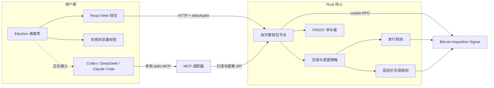

# Catomicals

[English](README.md) | 简体中文

Catomicals 是一套面向 Bitcoin Inquisition Signet 的自托管 covenant 钱包与应用研发栈，用于验证 `OP_CAT` 资产发行、受保护交易、Passkey 授权、FROST 门限签名和代理协作能否组成可运行产品。

> [!WARNING]
> 当前代码只允许连接 Signet，并且未经独立安全审计。密钥、凭据和防重放状态仍保存在进程内存中。**禁止用于主网，也禁止承载任何具有真实价值的资产。**

`catomicals` 是 CAT + Atomicals 的内部工程代号，没有协议含义。项目不会因此沿用 Atomicals、CAT Protocol 或 CAT20 的设计，也没有平台代币。

## 为什么研究 OP_CAT

`OP_CAT` 让 Bitcoin Script 可以拼接字节串，从而在 Taproot 脚本路径中重建并核对承诺、消息和局部状态。它为以下方向提供了新的验证构件：

- 由链上脚本校验的铸造门槛和状态承诺；
- 绑定明确报价与撤单条件的 UTXO 订单；
- 钱包可重复验证的交易意图、创作者费用和状态迁移；
- 无需通用虚拟机的局部金融与数字物品实验。

能力边界同样重要。当前发行脚本无法读取交易输出，物品所有者、后继状态和手续费仍由钱包策略检查；固定价交易依赖卖方 `SIGHASH_DEFAULT` 签名与钱包策略保护具体输出。项目会在代码、测试和文档中保留这些限制，不把实验网络结果描述成 Bitcoin 主网能力。

## 当前可运行能力

| 状态 | 能力 | 说明 |
| --- | --- | --- |
| 已实现 | Inquisition 节点检查 | 通过 cookie RPC 检查本机 Signet，并要求 BIP 347 / `OP_CAT` 已激活。 |
| 已实现 | 2-of-3 FROST 演示 | 运行 Zcash Foundation FROST DKG，聚合并独立验证 64 字节 BIP340 签名；仅用于本地开发验证。 |
| 已实现 | 自托管钱包节点 | 提供类型化 HTTP API、WebAuthn 注册与批准、不可变签名意图、交易检查和单个本地 FROST 参与者。 |
| 已实现 | Web 钱包 | 提供聊天工作台、真实节点状态、交易检查、签名意图、Passkey 仪式和签名阶段显示。聊天只能创建提案。 |
| 已实现 | 本地 MCP | Codex、DeepSeek Harness 等客户端可读取状态、检查交易、创建或取消意图；MCP 无权批准、签名或广播。 |
| 已实现 | 工作量证明发行实验 | `OP_CAT` 脚本校验当前状态的工作量证明与剩余量，钱包另行检查物品输出和后继状态。 |
| 已实现 | 固定价受保护交易实验 | 支持挂牌、买入、到期撤单以及卖方收款、固定创作者费用、买方所有权和手续费检查。 |
| 正在实现 | Electron 桌面壳 | 已有隔离渲染进程、右侧真实浏览器标签、工具区 IPC 和本地设置存储；仍需完成产品级联调与打包。 |
| 正在实现 | 对话执行器选择 | 界面已定义 Codex、DeepSeek Harness、Claude Code、模型、推理强度和工作目录配置；执行适配器目前返回“尚未连接”。 |
| 正在实现 | 账户入口 | 本机 Passkey 已用于钱包注册和交易授权；Google、Apple 与邮箱登录只有界面和类型定义，尚无 OAuth、邮件验证或账户后端。 |
| 规划 | 生产级保管与协议 | 持久化密钥、防重放存储、远程 FROST、备份恢复、认证代理传输、AMM 和主网评估均未完成。 |

## 组件关系



安全责任分工：用户界面和代理都可以读取状态、准备交易与创建提案；只有钱包节点完成的真实 Passkey 仪式可以释放一次性签名授权；FROST 参与者在生成签名份额前再次检查意图、摘要、会话、参与者、有效期和 nonce。

## 快速启动

### 1. 准备开发网络

安装脚本会下载 Bitcoin Inquisition `v29.4-inq`，核对官方 `SHA256SUMS`，复制示例配置，但不会启动节点或同步区块：

```bash
./scripts/install-bitcoin-inquisition.sh
```

随后使用 [config/bitcoin-signet.conf](config/bitcoin-signet.conf) 启动并同步 Inquisition Signet。RPC 默认监听 `127.0.0.1:38332`，认证 cookie 位于节点数据目录的 `signet/.cookie`。

节点同步并激活 `OP_CAT` 后，在项目根目录执行：

```bash
cargo run -p catomicals -- node health
```

### 2. 启动钱包节点

需要 Rust 1.91 或更高版本：

```bash
cargo run -p catomicals -- wallet serve \
  --addr 127.0.0.1:18787 \
  --rp-id localhost \
  --rp-origin http://localhost:5173 \
  --cors-origin http://localhost:5173
```

钱包节点会临时运行本地 2-of-3 DKG，并只保留参与者 1。进程退出后，当前密钥、Passkey、意图、聊天和防重放状态都会丢失。

可单独运行门限签名验证：

```bash
cargo run -p catomicals -- frost demo
```

### 3. 启动 Web 钱包

需要 Node.js 和 pnpm 11：

```bash
cd web
pnpm install
pnpm dev
```

打开 <http://localhost:5173>。浏览器地址必须与钱包节点的 `--rp-origin` 完全一致，WebAuthn 才能通过来源校验。

常用检查：

```bash
pnpm test
pnpm typecheck
pnpm build
```

### 4. 启动 Electron 桌面壳

桌面壳仍在实现中。开发模式会同时启动 Web 渲染器和 Electron：

```bash
cd desktop
pnpm install
pnpm dev
```

钱包节点需要在另一个终端运行。当前桌面壳可以承载右侧浏览器标签和本地设置；Codex、DeepSeek Harness、Claude Code 的命令执行尚未接通。

### 5. 接入 MCP

先启动钱包节点，再构建并运行标准输入输出 MCP 服务：

```bash
cargo build -p catomicals
cargo run -p catomicals -- mcp serve \
  --wallet-url http://127.0.0.1:18787
```

实际接入代理时，应配置已构建可执行文件的绝对路径。完整示例见 [docs/mcp.md](docs/mcp.md)。

## 开发网络

- 当前唯一允许的网络：Bitcoin Inquisition Signet。
- 示例 RPC：`127.0.0.1:38332`，只允许本机 cookie 认证。
- 钱包 API：`127.0.0.1:18787`，默认只监听回环地址。
- Web 开发地址：`http://localhost:5173`。
- Electron 内置静态渲染器使用 `http://localhost:5180`；开发模式仍加载 Vite 地址。
- Bitcoin 主网尚未激活本项目所依赖的 `OP_CAT` 规则。本仓库也没有主网网络类型、主网签名开关或生产部署承诺。

## 安全红线

- 不得删除 Signet 限制后直接连接主网。
- 不得用当前内存密钥、临时 DKG 或 Passkey 存储保管真实资产。
- 不得把 CORS、回环地址或桌面壳当作用户认证。
- 不得让聊天、MCP、模型执行器或浏览器标签获得 Passkey 响应、FROST 份额、长期密钥或一次性授权。
- 不得接受调用方提供的交易摘要代替钱包从完整交易和有序前序输出中重新计算摘要。
- 不得把索引器、界面显示或代理判断当作链上结算依据。
- 不得宣称交易具有先到先得公平性；竞争花费的最终顺序由 Bitcoin 确认决定。

完整边界与未完成项见 [docs/security.md](docs/security.md)。

## 完成度与下一阶段

当前仓库已经能在实验网络上串联“节点检查 → 交易检查 → 创建意图 → Passkey 批准 → FROST 本地参与者”的开发路径，并提供发行、固定价交易和 MCP 的可执行测试材料。

下一阶段按[后端实施路线](docs/plans/2026-08-27-catomicals-backend-roadmap.md)依次推进：

1. 先修复 Electron P0 安全阻断项：锁定可信渲染器原点，校验 IPC 调用方的原点和 frame 层级，并补全浏览器 DNS、跳转、partition 与会话隔离。
2. 实现最小可信节点访问层：使用新鲜链快照和节点解析的 prevout，加入 mempool 接受检查，并在广播前完成最后一次复核。
3. 把 `wallet serve` 推进为可持久化的 `walletd`：采用 SQLite WAL，事务性保存 nonce 与防重放状态，记录只追加的审计事件，并完成单钱包加密备份与恢复。
4. 建立 Electron/TypeScript 执行器宿主，接入 Codex、DeepSeek Harness 和 Claude Code，统一 MCP 边界，并用固定的 Cordis 插件注册表管理设置、权限、生命周期和健康状态。
5. 完成可重建 indexer 的第一条纵向链路和 policy 资产：覆盖区块、交易、UTXO、covenant transition、reorg undo 与 checkpoint，同时落地不可变的 policy 文档、制品、测试向量、绑定和激活记录。
6. 分布式 FROST、HSM、完整市场读侧、AMM 和后量子实验放在后续阶段，等待可信访问、持久化、执行器、索引和 policy 地基稳定后再推进。

## 文档索引

| 文档 | 内容 |
| --- | --- |
| [docs/architecture.md](docs/architecture.md) | Rust 组件、签名流程、交易流程和网络边界。 |
| [docs/security.md](docs/security.md) | 已强制执行的属性、已知缺口和上线前置条件。 |
| [docs/wallet-node.md](docs/wallet-node.md) | 钱包节点启动、HTTP API、WebAuthn 仪式与保管限制。 |
| [docs/mcp.md](docs/mcp.md) | 本地 MCP 配置、工具列表与代理权限边界。 |
| [docs/web-wallet.md](docs/web-wallet.md) | Web 钱包原则、接口、状态覆盖和人机能力对等规则。 |
| [后端实施路线](docs/plans/2026-08-27-catomicals-backend-roadmap.md) | Electron 安全、可信节点访问、持久化 walletd、执行器、索引、policy、托管与后续协议工作的实施顺序。 |
| [执行看板](docs/plans/2026-08-27-catomicals-execution-board.md) | B0-B8 的责任归属、实施顺序、基线与验收门禁。 |
| [发行设计](docs/plans/2026-08-27-covenant-pow-issuance.md) | `OP_CAT` 工作量证明发行的编码、证据与限制。 |
| [固定价交易设计](docs/plans/2026-08-27-protected-fixed-price-trading-design.md) | 挂牌、买入、撤单、创作者费用和竞争花费模型。 |
| [聊天工作台设计](docs/plans/2026-08-27-chat-wallet-workbench-design.md) | 对话式钱包界面、插件与安全边界。 |

## 验证

```bash
cargo test --workspace --all-targets
cd web && pnpm test && pnpm typecheck && pnpm build
cd ../desktop && pnpm test && pnpm typecheck && pnpm build
```

发行和交易脚本的 Inquisition 执行验证分别使用：

```bash
./scripts/verify-issuance-inquisition.sh
./scripts/verify-trading-inquisition.sh
```
